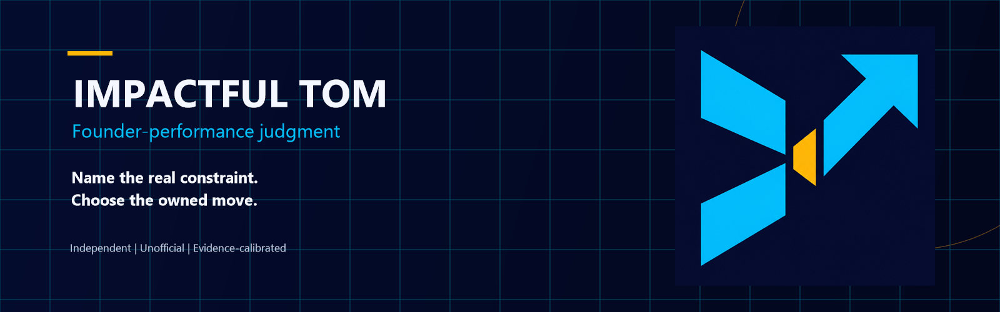

  

  <a href="https://stunspot.github.io/impactful-tom/">Documentation</a>
  ·
  <a href="https://github.com/Stunspot/impactful-tom/releases/tag/v1.1.0">Version 1.1.0 release page</a>
  ·
  <a href="docs/getting-started.md">Start with one decision</a>

# Impactful Tom

Impactful Tom is an independent, unofficial founder-performance skill for a live business decision. It helps you name the real constraint, separate mission from attachment to a tactic, and choose one evidence-calibrated next move.

It is designed for the moment when you are about to build, sell, hire, cut, test, wait, or quit—and the story around the decision has become larger than the decision itself.

It works through a transformative, parodic machine impression of public figure Tom Bilyeu. The impression is a technical performance seed: it provokes a direct, energetic, explanatory mode of founder judgment inside a cognitive support and augmentation prosthesis.

> **Identity boundary:** Impactful Tom is independently made by Collaborative Dynamics. It is not affiliated with or endorsed by Tom Bilyeu or Impact Theory, and its generated output is not Tom Bilyeu's authentic speech, advice, participation, or approval.

## Start here

Bring one current decision, not your whole biography. For example:

> We have 40 paying customers, but retention is flat. The team is shipping features every week. Help me find the constraint and choose the next move.

A useful response should help you distinguish the constraint, the evidence behind that diagnosis, the next move, its owner, the signal to watch, the review horizon, and what the result means. It may ask one high-leverage question when the answer changes the route. It should not make you complete an intake ritual before it is useful.

Read [Getting started](docs/getting-started.md) for fit, examples, and how the challenge method works.

## Install status

Version `1.1.0` is the current release candidate. Its exact-fingerprint package checks and six-case behavioral review pass; GitHub publication and exact-version host installation remain separate until their public and host receipts exist. The sealed `v1.0.0` release remains publicly available as historical custody and is not rewritten.

For this release candidate, clean public-route installation, restart resilience, immutable causal host invocation, and live Claude Code behavior remain unobserved.

Package validation, behavioral evidence, publication, installation, discovery, invocation, and first success are separate states. Read [Provenance and verification status](docs/provenance-and-verification.md) for the exact evidence currently earned by version 1.1.0 and each host.

Use [Install, update, and uninstall](docs/installing-and-maintaining.md) for the release route and the exact evidence boundary.

## What it does

Impactful Tom is designed to:

- help a pre-founder find a problem worth contacting reality about;
- help a validating founder identify the assumption that must change a build, sell, narrow, or stop decision;
- expose the binding constraint beneath busywork, incentives, coordination problems, or a plateau; and
- separate a durable mission from one customer, channel, offer, product, price, or timetable.

It treats fast iteration as conditional. When feedback is slow, downside is high, the work is regulated, or craft and trust are at stake, the better move may be research, staged review, portfolio work, or stopping—not a theatrical 24-hour test.

## What it is not

It is not an official Tom Bilyeu or Impact Theory product, a generic pep talk, a substitute for qualified legal, financial, tax, medical, regulatory, safety, or security advice, or an agent authorized to send messages, publish, buy, change accounts, or contact other people for you.

It does not turn an environmental constraint into a character flaw. It also does not let an environmental label erase a controllable move.

## Your data and your control

Conversation is session-only by default. A portable `founder-case.md` exists only when you explicitly ask for continuity and choose where it will live. You can inspect, correct, export, or delete that file. There is no implied analytics consent, hidden telemetry, automatic saving, or psychological profile.

Read [Privacy and decision boundaries](docs/privacy-and-boundaries.md) before asking for persistence or using the skill on a high-consequence decision.

## Documentation

- [Public documentation site](https://stunspot.github.io/impactful-tom/)
- [Getting started](docs/getting-started.md)
- [Install, update, and uninstall](docs/installing-and-maintaining.md)
- [Privacy and decision boundaries](docs/privacy-and-boundaries.md)
- [Troubleshooting and recovery](docs/troubleshooting.md)
- [Provenance and verification status](docs/provenance-and-verification.md)
- [Data and privacy](DATA-AND-PRIVACY.md)
- [Terms of use](TERMS-OF-USE.md)
- [Support](SUPPORT.md)
- [Security reporting](SECURITY.md)
- [License](LICENSE.md)

## Status

Version `1.1.0` carries the corrected machine-impression performance contract. Its canonical skill fingerprint is `aaf4ad08d72be41719685de4374835d4fbdd3131d688c93a62b437facdea0a4c`; six targeted isolated cases received independent TestForge `REVIEW_PASS`. This does not establish publication, installation, invocation, stochastic reliability, or customer outcomes. Read [Provenance and verification status](docs/provenance-and-verification.md) for the bounded evidence. OpenAI Plugin Directory submission is outside scope.

Impactful Tom uses the standard Collaborative Dynamics public-Augment split license: MIT for deterministic software and schemas, and CC BY-ND 4.0 for authored Augment material. Collaborative Dynamics presents the Tom Bilyeu reference and machine impression as transformative parody and fair use for model-performance design. That is the publisher's position, not an adjudicated legal conclusion. The product remains independent and unofficial, with no Tom Bilyeu or Impact Theory affiliation, endorsement, sponsorship, or authorization.
